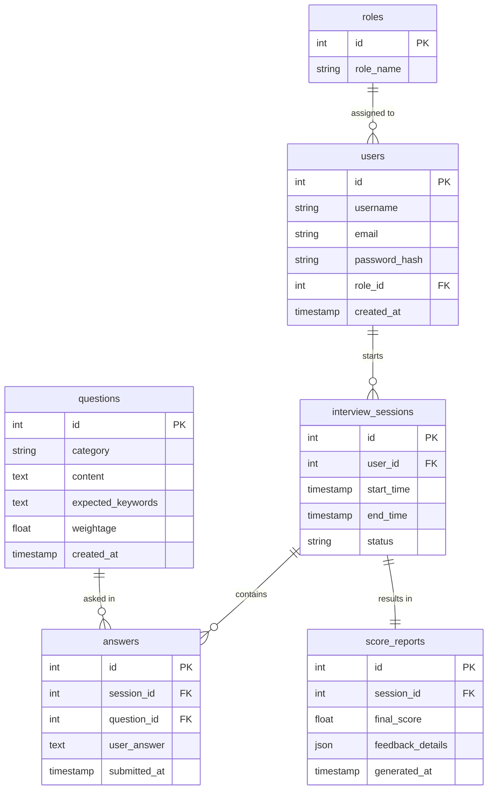

# Entity Relationship Diagram - MockMate AI Database Schema

```mermaid
erDiagram
    users {
        int id PK
        string username
        string email
        string password_hash
        int role_id FK
        timestamp created_at
    }

    roles {
        int id PK
        string role_name
    }

    questions {
        int id PK
        string category
        text content
        text expected_keywords
        float weightage
        timestamp created_at
    }

    interview_sessions {
        int id PK
        int user_id FK
        timestamp start_time
        timestamp end_time
        string status
    }

    answers {
        int id PK
        int session_id FK
        int question_id FK
        text user_answer
        timestamp submitted_at
    }

    score_reports {
        int id PK
        int session_id FK
        float final_score
        json feedback_details
        timestamp generated_at
    }

    roles ||--o{ users : "assigned to"
    users ||--o{ interview_sessions : "starts"
    interview_sessions ||--o{ answers : "contains"
    questions ||--o{ answers : "asked in"
    interview_sessions ||--|| score_reports : "results in"
```
