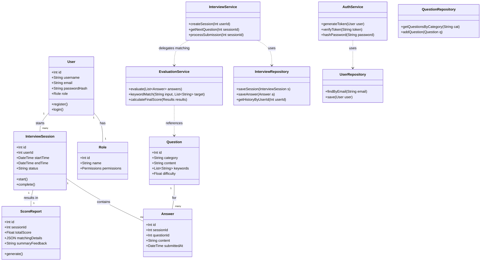

# Class Diagram - MockMate AI System Design

```mermaid
classDiagram
    %% Entities
    class User {
        +Int id
        +String username
        +String email
        +String passwordHash
        +Role role
        +register()
        +login()
    }

    class Role {
        +Int id
        +String name
        +Permissions permissions
    }

    class Question {
        +Int id
        +String category
        +String content
        +List~String~ keywords
        +Float difficulty
    }

    class InterviewSession {
        +Int id
        +Int userId
        +DateTime startTime
        +DateTime endTime
        +String status
        +start()
        +complete()
    }

    class Answer {
        +Int id
        +Int sessionId
        +Int questionId
        +String content
        +DateTime submittedAt
    }

    class ScoreReport {
        +Int id
        +Int sessionId
        +Float totalScore
        +JSON matchingDetails
        +String summaryFeedback
        +generate()
    }

    %% Services
    class AuthService {
        +generateToken(User user)
        +verifyToken(String token)
        +hashPassword(String password)
    }

    class InterviewService {
        +createSession(Int userId)
        +getNextQuestion(Int sessionId)
        +processSubmission(Int sessionId)
    }

    class EvaluationService {
        +evaluate(List~Answer~ answers)
        +keywordMatch(String input, List~String~ target)
        +calculateFinalScore(Results results)
    }

    %% Repositories
    class UserRepository {
        +findByEmail(String email)
        +save(User user)
    }

    class QuestionRepository {
        +getQuestionsByCategory(String cat)
        +addQuestion(Question q)
    }

    class InterviewRepository {
        +saveSession(InterviewSession s)
        +saveAnswer(Answer a)
        +getHistoryByUserId(Int userId)
    }

    %% Relationships
    User "1" -- "1" Role : has
    User "1" -- "many" InterviewSession : starts
    InterviewSession "1" -- "many" Answer : contains
    Question "1" -- "many" Answer : for
    InterviewSession "1" -- "1" ScoreReport : results in

    InterviewService ..> InterviewRepository : uses
    EvaluationService ..> Question : references
    AuthService ..> UserRepository : uses
    InterviewService ..> EvaluationService : delegates matching
```
