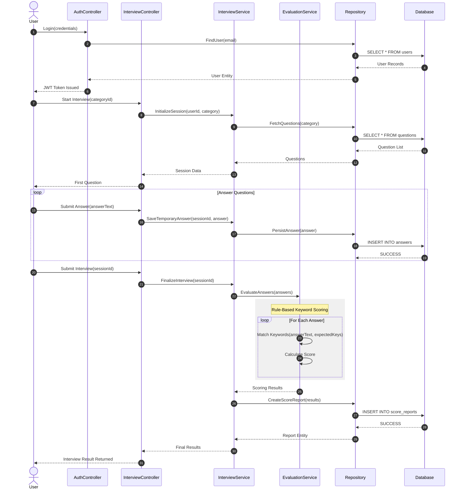

# Sequence Diagram - Interview Flow

```mermaid
sequenceDiagram
    autonumber
    actor User
    participant Auth as AuthController
    participant Interview as InterviewController
    participant Service as InterviewService
    participant Eval as EvaluationService
    participant Repo as Repository
    participant DB as Database

    User->>Auth: Login(credentials)
    Auth->>Repo: FindUser(email)
    Repo->>DB: SELECT * FROM users
    DB-->>Repo: User Records
    Repo-->>Auth: User Entity
    Auth-->>User: JWT Token Issued

    User->>Interview: Start Interview(categoryId)
    Interview->>Service: InitializeSession(userId, category)
    Service->>Repo: FetchQuestions(category)
    Repo->>DB: SELECT * FROM questions
    DB-->>Repo: Question List
    Repo-->>Service: Questions
    Service-->>Interview: Session Data
    Interview-->>User: First Question

    loop Answer Questions
        User->>Interview: Submit Answer(answerText)
        Interview->>Service: SaveTemporaryAnswer(sessionId, answer)
        Service->>Repo: PersistAnswer(answer)
        Repo->>DB: INSERT INTO answers
        DB-->>Repo: SUCCESS
    end

    User->>Interview: Submit Interview(sessionId)
    Interview->>Service: FinalizeInterview(sessionId)
    Service->>Eval: EvaluateAnswers(answers)
    
    rect rgb(240, 240, 240)
        Note over Eval: Rule-Based Keyword Scoring
        loop For Each Answer
            Eval->>Eval: Match Keywords(answerText, expectedKeys)
            Eval->>Eval: Calculate Score
        end
    end

    Eval-->>Service: Scoring Results
    Service->>Repo: CreateScoreReport(results)
    Repo->>DB: INSERT INTO score_reports
    DB-->>Repo: SUCCESS
    Repo-->>Service: Report Entity
    Service-->>Interview: Final Results
    Interview-->>User: Interview Result Returned
```
