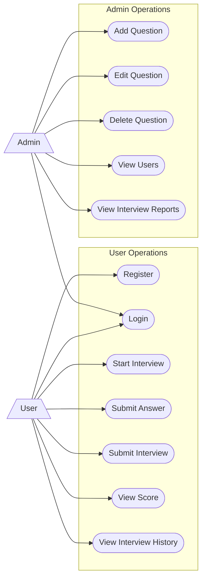

# Use Case Diagram - MockMate AI

```mermaid
flowchart LR
    User[/"User"\] 
    Admin[/"Admin"\]

    subgraph User_Operations [User Operations]
        UC1([Register])
        UC2([Login])
        UC3([Start Interview])
        UC4([Submit Answer])
        UC5([Submit Interview])
        UC6([View Score])
        UC7([View Interview History])
    end

    subgraph Admin_Operations [Admin Operations]
        UC8([Add Question])
        UC9([Edit Question])
        UC10([Delete Question])
        UC11([View Users])
        UC12([View Interview Reports])
    end

    User --> UC1
    User --> UC2
    User --> UC3
    User --> UC4
    User --> UC5
    User --> UC6
    User --> UC7

    Admin --> UC2
    Admin --> UC8
    Admin --> UC9
    Admin --> UC10
    Admin --> UC11
    Admin --> UC12
```
